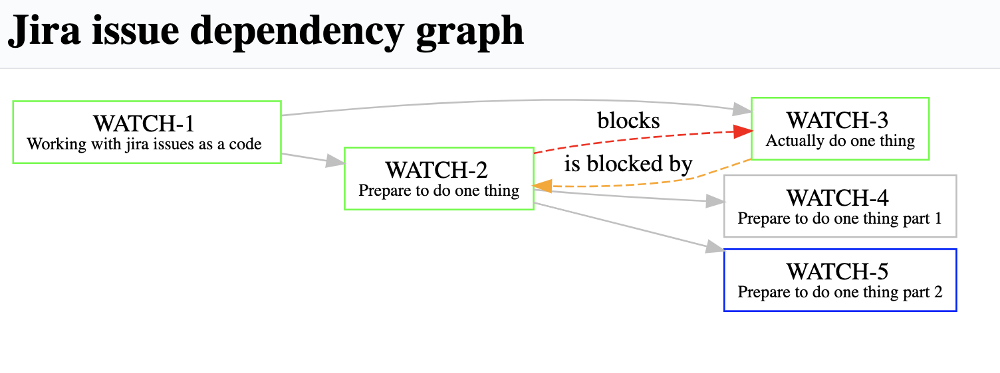

# Web UI for JAM - https://github.com/avvero/jam



Gradle composite approach is been using and jam project is required to be at `../jam`. 
But it could be changed in `settings.gradle`.

## Features

Depth: 
- **Epic** -> Issue of any kind in Epic 
- Issue with type **Initiative** -> Issue of any kind where **Initiative** **is parent task of**

Link of any kind between issues.

Issues on graph are clickable.

## Launching

```properties
docker run --name jam-wui -p 8080:8080 --env app.jira.host=http://localhost:8081 --env app.jira.username=admin --env app.jira.password=admin -it avvero/jam-wui:latest
```

Also docker-compose.yml is provided.

## Properties

```properties
app.jira.host = http://localhost:8081
app.jira.username = admin
app.jira.password = admin
```

## Application endpoints

`/dependencies?checkout=?` - Checkouts issue by key and returns schema representation

`/dependencies?issueCode=?` - Returns graphviz schema with dependencies